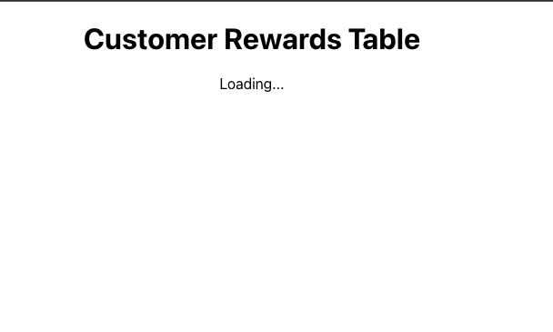
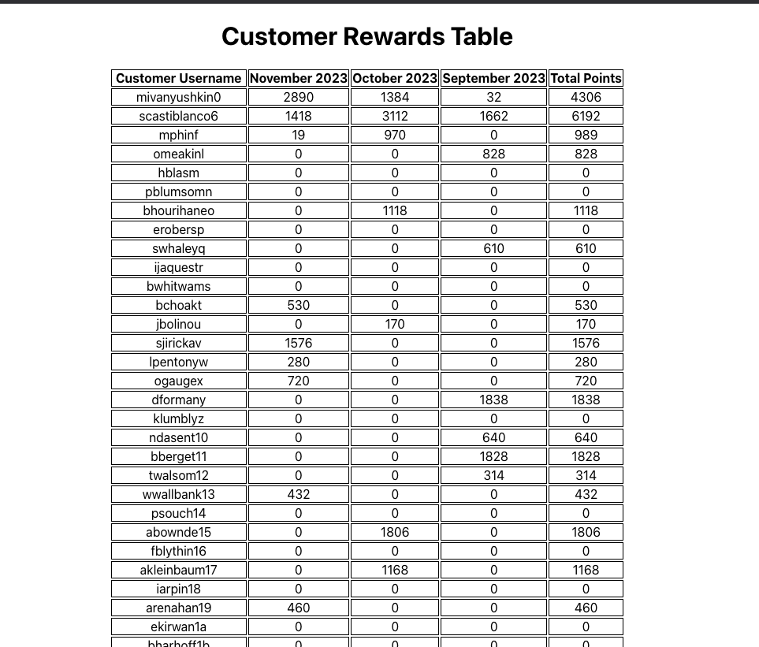

# App Instructions 

- To run app, run "npm start" in your Terminal. 
- To load/get transaction data to work, navigate to rewards-app folder in Terminal if you are not there and run "npm run serve"
- Visit http://localhost:3500/transactions to see data. 
- The data includes transactions that are outside of the Sept - Nov range to show exclusion of transactions. 

# Enhancements I would make if time permitted
- Include a date feature where the user can either:
    - enter in the number of months they want see
    - enter a date range and see a monthly breakdown for that range
- Include a feature where the user can enter a username have the table filter to just that users information. 
- I would add more styling enhancements - I kept most of the focus on the functionlity for this coding assessment. Below are some websites I have built that showcase my styling abilities. 
    - [Spencer Fane Law Firm](https://www.spencerfane.com/services/)
    - [PromoPulse](https://promopulse.io/)
    - [Saints Block Party Podcast](https://saintsblockparty.com/)

# Screenshots 
Loading State for the App

Loaded State for the App
